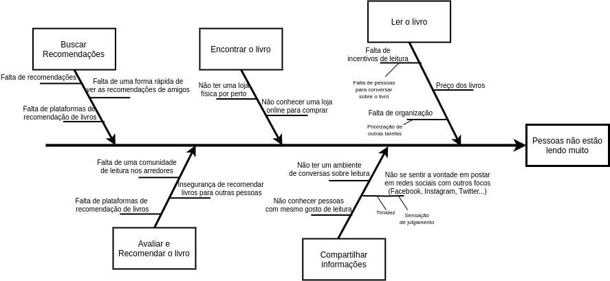

|    Data    | Versão |                 Descrição                 |     Autores     |
| :--------: | :----: | :---------------------------------------: | :-----------: |
| 20/03/2020 |  0.1   | Criação do diagrama e do documento de Ishikawa | Iuri Severo e João Pedro  |

# Ishikawa
## Introdução
### Definição
O diagrama de Ishikawa, também conhecido como diagrama de espinha de peixe e diagrama de causa e efeito, é uma técnica utilizida para encontrar causa raizes de um problema.

### Justificativa para uso da Técnica
Foi utilizado pois é uma técnica recomendada para que o grupo entenda melhor o problema que o software está vindo para solucionar e entenda quais são as causas do mesmo.

### Aplicação
O metodo utilizado para definir as categorias foi "Etapas do Processo" onde o grupo pegou as etapas que uma pessoa normalmente faz para encontrar um livro novo para ler.

```
1. Buscar recomendações
2. Encontrar o livro
3. Ler o livro
4. Avaliar e recomendar livros
5. Compartilhar informações
```
## Diagrama de Ishikawa


## Referências
- [Diagrama de Ishikawa (Ferramenta da Qualidade)](https://www.youtube.com/watch?v=U-0qzmFqH-0&feature=emb_title)
- [Edição do Brasil](http://edicaodobrasil.com.br/2018/10/26/44-da-populacao-brasileira-nao-pratica-o-habito-da-leitura/)
- [Guia de Cratividade - Diagrama de Ishikawa](https://sites.google.com/site/guiadecriatividade/47---diagrama-de-ishikawa?authuser=0)