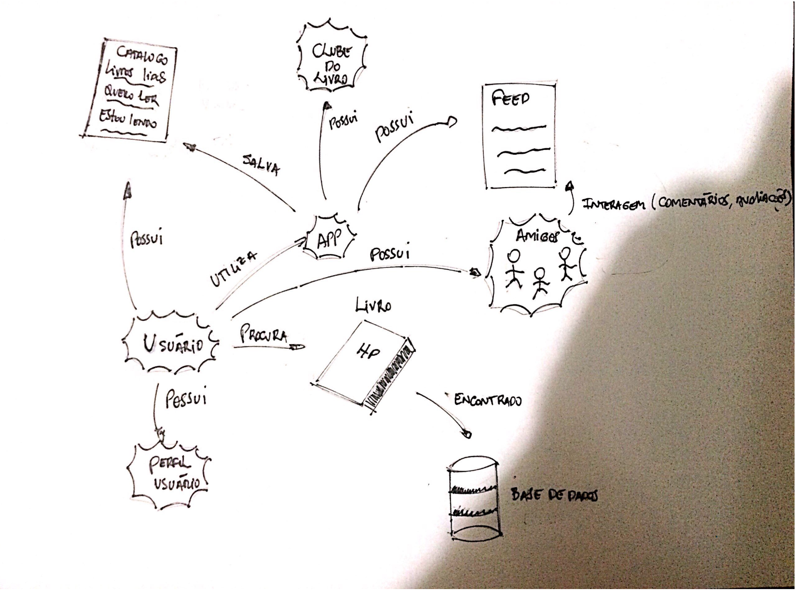
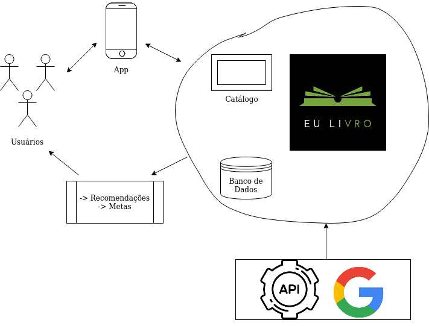
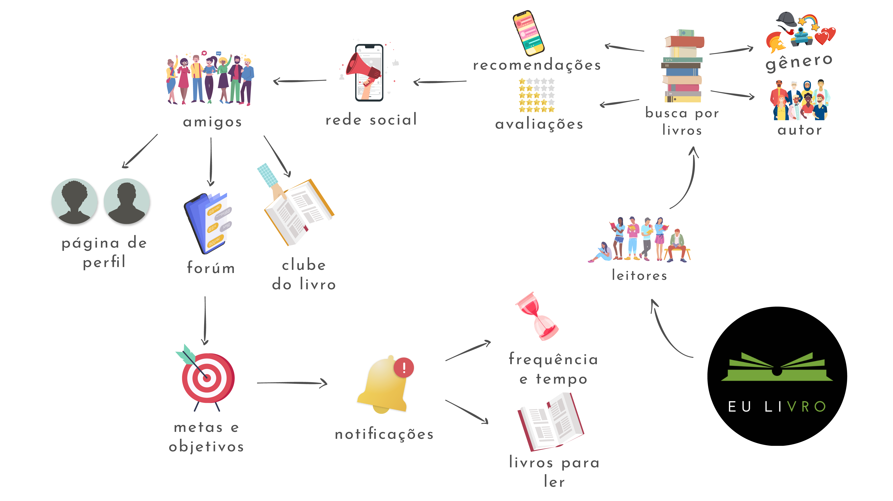

|    Data    | Versão |                          Descrição                          |     Autores      |
| :--------: | :----: | :---------------------------------------------------------: | :--------------: |
| 19/03/2020 |  0.1   | Criação do documento, adição da introdução e richPicture 1. | [Micaella Gouveia](https://github.com/micaellagouveia) |
| 19/03/2020 |  0.2   |                  Adição do richPicture 2.                   | [Guilherme Mendes](https://github.com/guilherme-mendes) |
| 19/03/2020 |  0.3   |                  Adição do richPicture 3.                   |   [Gabriel Davi](https://github.com/GabrielDVpereira)   |
| 20/03/2020 |  0.4   |                  Adição do richPicture 4.                   |   [Caio Fernandes](https://github.com/caiovfernandes)   |
| 20/03/2020 |  0.5   |                  Adição do richPicture 5.                   |   [Lucas Fellipe](https://github.com/lucasfcm9)   |
| 20/03/2020 |  0.6   |                  Adição do richPicture 6.                   |   [Eduardo Lima](https://github.com/Ed-vL)  |
| 21/03/2020 |  0.7   |                  Adição do richPicture 7.                   |   [Sofia Patrocinio](https://github.com/sofiapatrocinio)   |

# Rich Picture

Na fase de pré-rastreabilidade, é comum a produção dos Rich Pictures. Eles são uma forma de explorar, entender e definir uma situação, por meio de diagramas feito a mão ou digitalmente, essa situação pode ser o sistema completo ou sub-sistemas, podendo mostrar partes internas e externas do projeto, explicitando o funcionamento da aplicação, e ajuda o cliente a entendê-lo. 
No início do projeto, definimos que cada membro faria um rich picture, afim de avaliarmos as ideias expostas, e desenvolvermos um rich picture final.

## Rich Picture 1

Autora: Micaella Gouveia 

## Rich Picture 2

Autor: Guilherme Mendes 

## Rich Picture 3

Autor: Gabriel Davi Silva Pereira 

## Rich Picture 4

Autor: Caio Vinícius Fernandes 

## Rich Picture 5

Autor: Lucas Fellipe Carvalho Moreira 

## Rich Picture 6

Autor: Eduardo Vieira Lima 

## Rich Picture 7

Autora: Sofia Patrocínio 

## Referências

[https://www.betterevaluation.org/en/evaluation-options/richpictures](https://www.betterevaluation.org/en/evaluation-options/richpictures) Disponível em 19/03.
