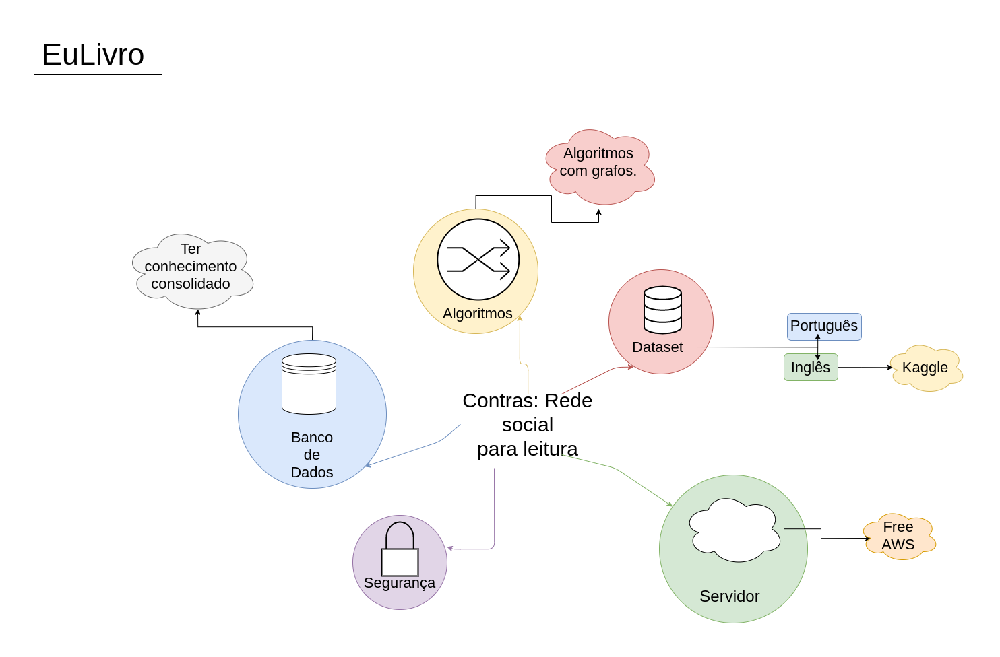

|    Data    | Versão |                 Descrição                 |     Autor     |
| :--------: | :----: | :---------------------------------------: | :-----------: |
| 17/03/2020 |  0.1   | Criação do documento e adição do relato dos Contras. | Pedro Igor  |
| 18/03/2020 |  0.2   | Adição do relato da Ideia, justificativa do uso da técnica e referências |  Micaella Gouveia |
| 18/03/2020 |  0.3   | Adição do mapa mental da Ideia. |  Micaella Gouveia |
| 18/03/2020 |  0.4   | Adição do mapa mental dos Contras. |  Pedro Igor |
| 18/03/2020 |  0.5   | Adição da definição de Brainstorming e o relato sobre o Escopo |  Gabriel Alves |

# Brainstorming

## Introdução

### Definição
"Brainstorming é uma técnica utilizada para propor soluções a um problema específico. Consiste em uma reunião também chamada de tempestade de ideias, na qual os participantes devem ter liberdade de expor suas sugestões e debater sobre as contribuições dos colegas." [PATEL, Neil](https://neilpatel.com/br/blog/o-que-e-brainstorming/)

### Justificativa para uso da Técnica
Optamos em utilizar a técnica de brainstorming pois ela geralmente é utilizada no início de projetos, pois os participantes ganham a oportunidade de exporem suas ideias, sem restrição, além de conseguirem complementar a ideia proposta por outro membro. Além dos participantes ganharem mais empatia com o projeto, pois as suas ideias estão sendo cogitadas.

## Participantes
- Todos os membros.

## Brainstormings

### Ideia
Foi realizada uma discussão em grupo para levantar as ideias de como o aplicativo deveria funcionar.

#### Organização

- Micaella: Um usuário adicionaria o livro que está lendo e poderia ver o que os outros usuários estão lendo, se outro usuário estiver lendo ou já leu aquele livro, eles poderiam iniciar um chat.
- Caio: Vamos ter um banco com vários livros já cadastrados. A pessoa iria adicionar os livros que ela já leu, os livros que ela está lendo e seus interesses, como gêneros, autores.
- Micaella: O aplicativo pode ser divido em parte individual(suas metas) e coletiva(clube do livro, chat).

#### Chat e Rede Social

- Caio: Pode ser como uma mini rede social, em que se pode abrir chats de conversa.
- Gabriel Alves: Poderia ter a opção de um grupo aberto ou fechado para determinados usuários.
- Micaella: Pode ter a opção de se criar um clube do livro, definindo metas em grupo.
- Eduardo: Podemos fazer a criação do seu perfil, tendo as recomendações do usuário.
- Iuri: Poderia ter um chat para cada livro, porém isso demandaria muita memória.
- Gabriel Alves: Os chats para grupos poderiam ser moderados pelo próprio autor (Comunidade do autor).
- Sofia: Mas muitos autores já morreram, então o autor deveria ter um cadastro também.

#### Página do Autor
- Sofia: O autor poderia ser um usuário? cada autor teria uma página?
- Caio: Teria uma página do autor, mostrando quais amigos curtiram o autor.
- Micaella: Ele poderia ser um usuário mas que tem um certificado de autor.
- Micaella: Na página do autor pode ter quantidade de usuários que curtem, seus livros mais famosos.

#### Avaliações
- Lucas: Para as avaliações do livro podemos colocar um espaço para os comentários sobre o livro. Cada um escreveria o que achou do livro.
- Eduardo: A avaliação do livro pode ser por estrelas, seria um jeito mais fácil de lidar com classificações.

#### Separação por gêneros
- João Pedro: Podemos fazer uma separação por gêneros, para ser mais fácil na hora de explorar novos livros.
- Lucas: O usuário então deveria escolher seus gêneros para fazermos recomendações.
- Sofia: O usuário deveria fazer essa escolha ao se cadastrar.

#### Compra do Livro
- Lucas: Podemos colocar sites que vendem o livro procurado.

#### Mapa Mental da Ideia:

### Escopo
Foi realizada uma descussão em grupo sobre o escopo do projeto, delimitando seus limites.

#### Base de Dados para os Livros

- Caio: Fica inviável popularmos a base de livros na mão.
- Pedro: Podemos limitar o número de livros á 80, por exemplo e testar.
- Caio: Provavelmente deve exister algum dataset disponível com esses livros. Vamos tentar pesquisar no Kaggle.
- Lucas: Achei a API do Google que fornece os dados dos livros.

#### Parte Individual do Usuário
 - Pedro: Qual a primeira funcionalidade que a aplicação deveria ter?
 - Micaella: A parte indivídual do usuário.
 - Iuri: O programa deve listar o que você já leu, o que gostaria de ler, lista de recomendações e a TOP 10 LISTA do usuário.

 #### Conexão Entre Usuários
 - Iuri: Depois da parte individual vem a conexão das pessoas. Recomendar amigos em comum, relacionado pelos livros de interesse.
 - Sofia: É parecido com a recomendação de compra de livros online, onde sugere livros que as pessoas também compraram.
 - João Pedro: Podemos fazer à avalições dos livros, por estrela.
 - Iuri: Avaliar livro tem que estar junto com a conexação das pessoas.

### Contras
Foi realizada uma discussão em grupo sobre os pontos contras da escolha desse tema para o projeto.
#### Dataset
- Iuri: Pode ser difícil conseguir uma api em português e inglês para o dataset.
- Caio: Já encontrei um dataset no kaggle só que é em inglês.

#### Banco de Dados
- Pedro Igor: Mexeremos bastante com banco de dados, temos que ter um conhecimento bastante consolidado.
- João Pedro: Eu sei o básico de mongo.
- Iuri: Teremos que trabalhar com mongo.

#### Servidor
- Pedro Igor: Teremos que deixar isso online, precisaremos de um servidor.
- Eduardo: Dependendo da quantidade do uso é possível utilizar um servidor AWS (Amazon) gratuito.

#### Segurança
- Iuri: Não sei quanto de dados coletaremos do usuário no cadastro porém segurança é algo a se preocupar.

#### Algoritmos
- Sofia: O quão difícil é fazer um algoritmo de interesse baseado em informações do usuário?
- Iuri: Muito provavelmente utilizaremos algoritmos com grafos.
- Pedro Igor: Precisaremos desenvolver alguns algoritmos um pouco mais complexos, temos que tomar cuidado com o tempo para não fugir o prazo.

#### Implementação de algumas features
- Eduardo: Acredito que tenhamos pouco tempo para implementarmos a função de grupos de conversas.

### Mapa Mental Contras

## Referências
[Vantagens de um Brainstorming](https://www.oxigenweb.com.br/artigos/8-vantagens-de-um-brainstorming/)

