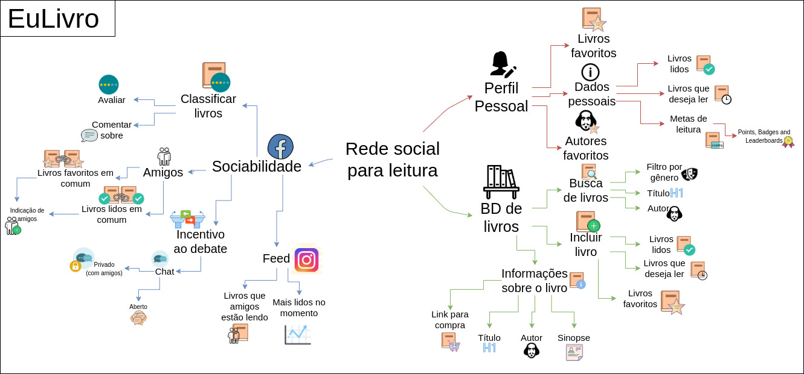

|    Data    | Versão |                 Descrição                 |     Autor     |
| :--------: | :----: | :---------------------------------------: | :-----------: |
| 18/03/2020 |  0.1   | Criação do Mapa Mental | Iuri Severo e João Pedro  |
| 20/03/2020 |  0.2   | Criação do documento   | Iuri Severo e João Pedro  |

# Mapa Mental

## Introdução

### Definição
Mapa mental é uma técnica de estudo que consiste em criar resumos visuais com a intenção de auxiliar no armazenamento, organização e priorização de informações e pensamentos, com maior rapidez e eficiência.
É composto por símbolos, cores, setas, imagens e palavras chave, e sua estrutura é similar a maneira na qual o cérebro armazena e assimila informações, o que garante maior destreza na recordação de acontecimentos e ideias.

### Justificativa para o uso da técnica
Esse mapa mental foi desenvolvido para uma melhor organização e visualização das ideias propostas para o projeto pelo time. Como foi dito na definição, o mapa mental garante maior destreza na recordação de acontecimentos e ideias, por isso foi escolhido pela equipe para elicitação de requisitos.

## Mapa Mental

## Requisitos levantados
### Funcionais
|Número|Requisito|
| :--------: | :----: |
|1|O usuário deve poder pesquisar por um livro específico.
|2|O usuário deve poder adicionar livros ao seu catálogo.
|3|O usuário deve poder marcar os livros que está lendo no momento.
|4|O usuário deve poder cadastrar suas metas individuais.
|5|O usuário deve poder criar grupos de discussão.
|6|O usuário deve poder criar chats individuais.
|7|O usuário deve poder criar o seu perfil.
|8|O usuário deve poder visualizar o perfil de outros usuários.
|9|O sistema deve possuir chats públicos e privados.
|10|O usuário deve poder ver os livros de um autor.
|11|O usuário deve poder avaliar um livro por estrelas.
|12|O usuário deve poder adicionar um comentário sobre um livro.
|13|O usuário deve poder fazer um TOP10 dos seus livros.
|14|O sistema deve sugerir ao usuário livros que outras pessoas estão lendo.
|15| O usuário deve poder visualizar seu catalogo.
|16| O usuário deve poder adicionar livros que quer ler em uma lista.
|17| O usuário deve poder visualizar lista de livros que deseja ler.
|18| O usuário deve poder adicionar seus autores favoritos em uma lista.
|19| O usuário deve poder visualizar a lista de autores favoritos.
|20| O usuário deve poder pesquisar livros pelo nome do autor.
|21| O usuário deve poder filtrar a pesquisa por gênero.
|21| O livro deve ter informações sobre o autor.
|22| O livro deve ter sinopse.
|23| O livro deve estar acompanhado de um link para compra.
|24| O usuário deve poder adicionar amigos.
|25| O usuário dever poder ver os livros favoritos que tem em comum com outras pessoas.
|26| O usuário deve poder ver os livros lidos que tem em comum com outras pessoas.
|27| O usuário deve receber indicações de amigos baseado em seu catálogo pessoal.
|28| O feed deve conter a lista de livros mais lidos no momento.
|29| O usuário deve poder receber recompensas em forma de pontos, conquistas e placar de pontos.

## Não Funcionais
|Número|Requisito|
| :--------: | :----: |
|1|O sistema deve oferecer uma base de dados dos livros.

## Referências
- [PAX](https://pax-app.github.io/Wiki/#/docs/DS/dinamica-e-seminario-1/MapaMental)
- [Mapa Mental: o que é? Como fazer? Aprenda agora!](https://www.stoodi.com.br/blog/2018/02/08/como-fazer-um-mapa-mental/)
- MATUDA, Danielle M.; BEGOSSO, Luiz C. Mapas Mentais na Engenharia de Requisitos. A, Assis, SP - Brasil.
- [Seja Um Estudante Melhor](https://www.youtube.com/watch?v=m1qW0wPJV1M&feature=emb_logo)
- [Icons8](https://icons8.com/)